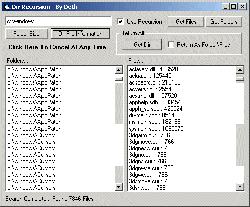



## Directory Recursion

### Description

Shows How To Get Directorys/Folder Contents And Calculate All File Sizes Using Pure Vb Code, without using any controls 

----

Updated 11/06/03 This submission was long a thorn in my side because it never worked as well as it was intended to, well the pain is gone and its now better than ever!! all file related functions now fully support file masks, and all code has been optimized for maximum speed!

----

forget slow fso code!
 
### More Info
 

             |
---                |---
**Submitted On**   |2003-11-06 11:58:36
**By**             |[Deth](https://github.com/Planet-Source-Code/PSCIndex/blob/master/ByAuthor/deth.md)
**Level**          |Beginner
**User Rating**    |5.0 (30 globes from 6 users)
**Compatibility**  |VB 5\.0, VB 6\.0
**Category**       |[Files/ File Controls/ Input/ Output](https://github.com/Planet-Source-Code/PSCIndex/blob/master/ByCategory/files-file-controls-input-output__1-3.md)
**World**          |[Visual Basic](https://github.com/Planet-Source-Code/PSCIndex/blob/master/ByWorld/visual-basic.md)
**Archive File**   |[Directory\_1668461162003\.zip](https://github.com/Planet-Source-Code/deth-directory-recursion__1-42589/archive/master.zip)

